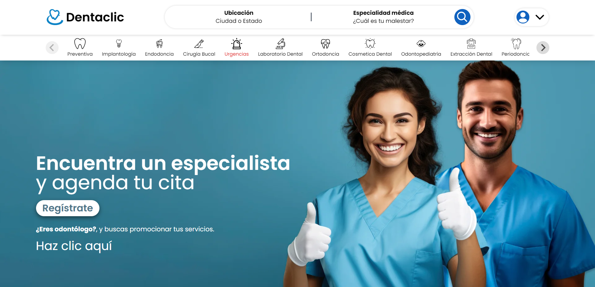

<a id="readme-top"></a>

<!-- PROJECT LOGO -->
<br />
<div align="center">
  <a href="https://github.com/leonelvalentinn/dentaclick">
    
  </a>

  <p></p>
</div>

<!-- TABLE OF CONTENTS -->
<details>
  <summary>Contenido</summary>
  <ol>
    <li>
      <a href="#acerca-del-proyecto">Acerca del proyecto</a>
      <ul>
        <li><a href="#creado-con">Creado con</a></li>
      </ul>
    </li>
    <li>
      <a href="#para-empezar">Para empezar</a>
      <ul>
        <li><a href="#prerequisitos">Prerequisitos </a></li>
        <li><a href="#instalación">Instalación</a></li>
      </ul>
    </li>
  </ol>
</details>

<!-- ABOUT THE PROJECT -->

## Acerca del proyecto

<div align="center">
  <a href="https://dentaclic.dentarios.com.mx">
    
  </a>

  <p></p>
</div>

Bienvenido a nuestra plataforma de citas con odontólogos, un proyecto diseñado para facilitar tanto a pacientes como a profesionales de la odontología. Nuestra aplicación permite a los pacientes encontrar y agendar citas con odontólogos de manera sencilla y eficiente. Además, ofrece a los odontólogos una herramienta poderosa para promocionar sus servicios y atraer a más pacientes.

<p align="right">(<a href="#readme-top">Volver arriba</a>)</p>

### Creado con

- [![React][React.js]][React-url]
- [![tailwindcss][tailwindcss]][tailwind-url]

<p align="right">(<a href="#readme-top">Volver arriba</a>)</p>

<!-- GETTING STARTED -->

## Para empezar

### Prerequisitos

- Node.js versión LTS [Descargar Node.js](https://nodejs.org/en/download/package-manager/current)

  ```sh
  npm install npm@latest -g
  ```

### Instalación

1. Clona el repositorio
   ```sh
   git clone https://github.com/leonelvalentinn/dentaclick.git
   ```
2. Instala los paquetes de NPM
   ```sh
   npm install
   ```
3. Ejecuta el proyecto
   ```sh
   npm run dev
   ```

<p align="right">(<a href="#readme-top">Volver arriba</a>)</p>

## Contribuir al proyecto

Para contribuir algún cambio, por favor haz un [_fork_](https://github.com/leonelvalentinn/dentaclick/fork) del repositorio y crea una [_pull request_](https://github.com/leonelvalentinn/dentaclick.git/pulls). También puedes simplemente abrir un [_issue_](https://github.com/leonelvalentinn/dentaclick.git/issues) con la etiqueta "enhancement".

Aquí tienes una guía rápida:

1. Haz un [_fork_](https://github.com/leonelvalentinn/dentaclick/fork) del Proyecto
2. Clona tu [_fork_](https://github.com/leonelvalentinn/dentaclick/fork) (`git clone <URL del fork>`)
3. Añade el repositorio original como remoto (`git remote add upstream <URL del repositorio original>`)
4. Crea tu Rama de Funcionalidad (`git switch -c feature/CaracteristicaIncreible`)
5. Realiza tus Cambios (`git commit -m 'Add: alguna CaracterísticaIncreible'`)
6. Haz Push a la Rama (`git push origin feature/CaracteristicaIncreible`)
7. Abre una [_pull request_](https://github.com/leonelvalentinn/dentaclick/pulls)

<p align="right">(<a href="#readme-top">Volver arriba</a>)</p>

<!-- MARKDOWN LINKS & IMAGES -->

[dentaclic-screenshot]: src/assets/images/Dentaclic-hero.png
[React.js]: https://img.shields.io/badge/React-20232A?style=for-the-badge&logo=react&logoColor=61DAFB
[React-url]: https://reactjs.org/
[tailwindcss]: https://img.shields.io/badge/Tailwind-ffffff?style=for-the-badge&logo=tailwindcss&logoColor=38bdf8
[tailwind-url]: https://tailwindcss.com
